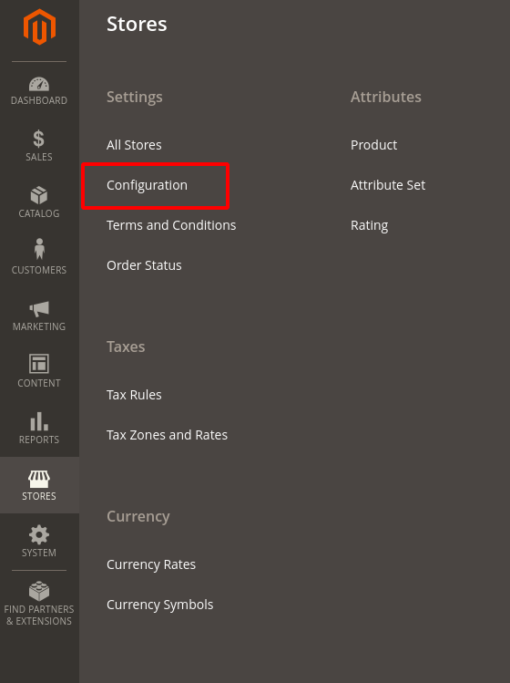
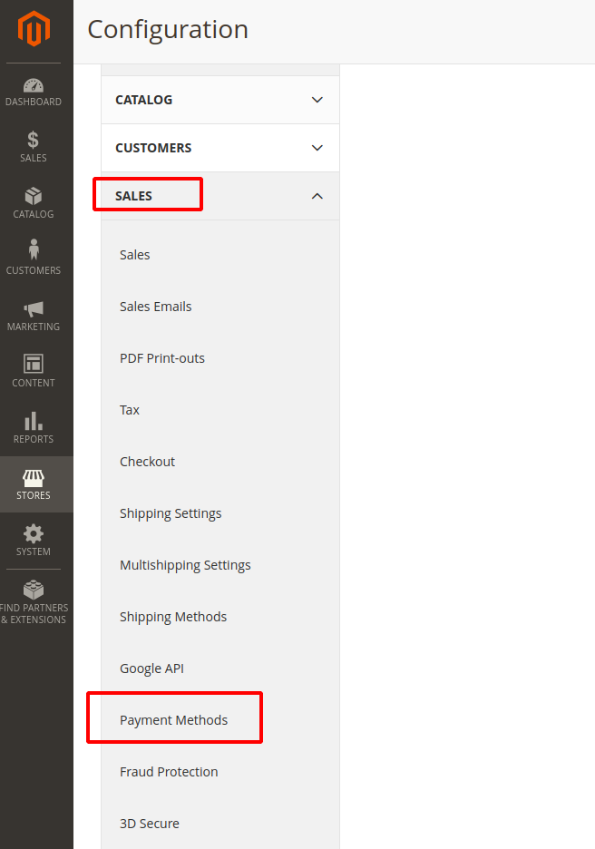
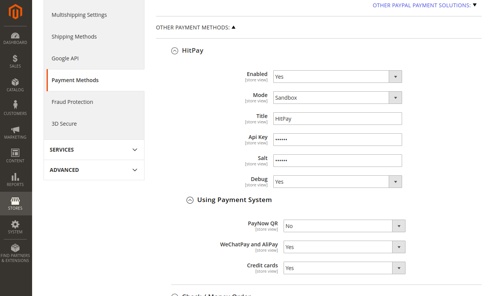
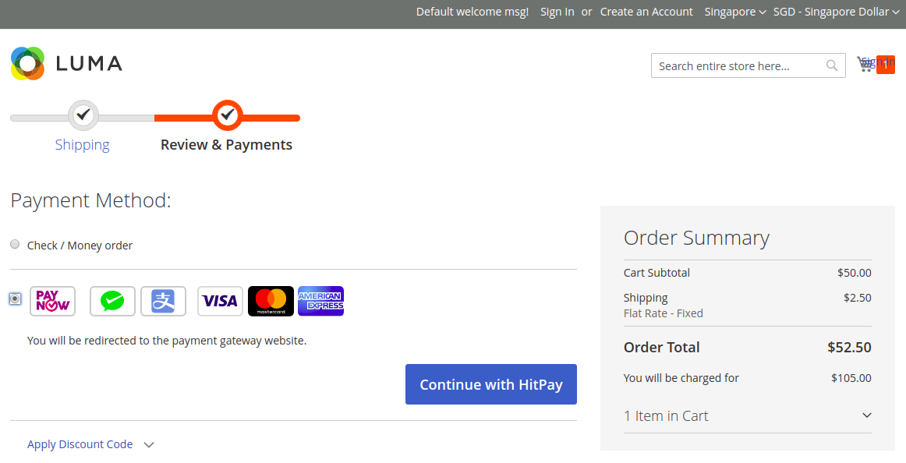

# HitPay Gateway Extension for Magento 2


[**HitPay**](https://www.hitpayapp.com/) provides a seamless payment experience for your customers and an easy integration process for the developers. Hitpay payment works by creating Payment Request and then the customers accepting the Payment Request.


## Step 1: Add to composer.json hitpay repositories

1. File composer.json

``` json
"repositories": [
    {
        "type": "vcs",
        "url": "https://github.com/hit-pay/magento2-extension.git"
    },
    {
        "type": "vcs",
        "url": "https://github.com/hit-pay/php-sdk.git"
    }
]
```

2. Run the command in terminal

```
composer require softbuild/hitpay:1.0.4;
```

## Step 2: Enable magento 2 extension in terminal

```
php -f bin/magento setup:upgrade;
php -f bin/magento setup:di:compile;
```

## Step 3: Configuration the extension

You need to have Api Key and Salt. The values you can take from [the page](https://dashboard.staging.hit-pay.com/) after registration






After set up the Api Key and Salt You can go to checkout page

