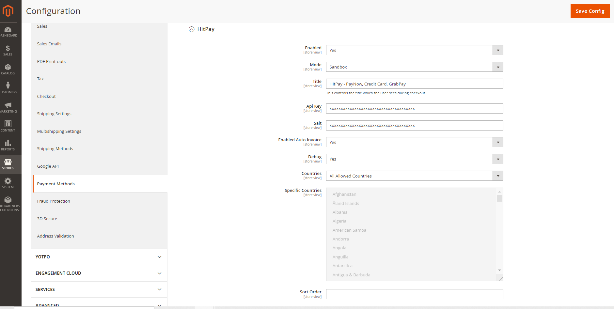
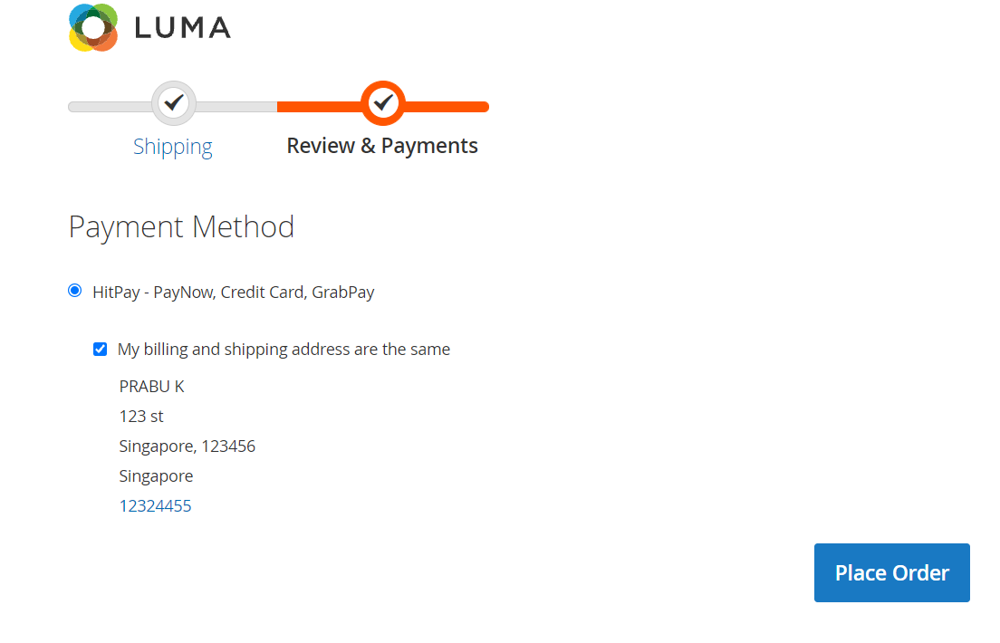
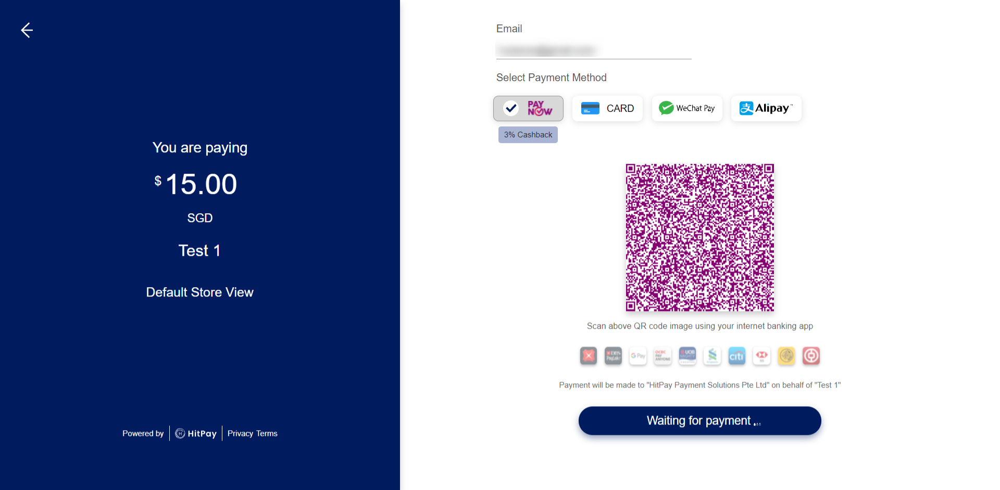
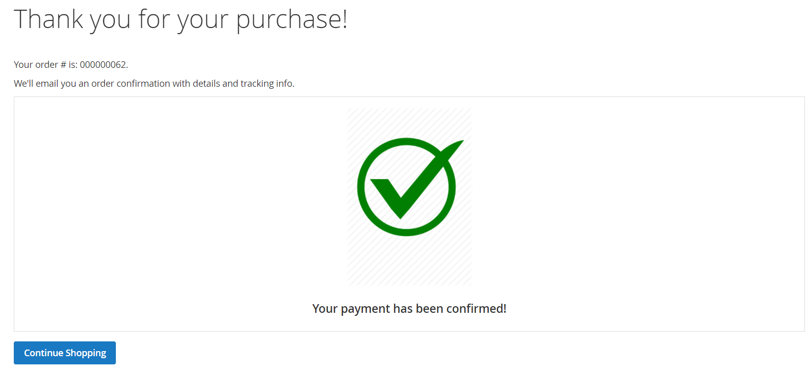

# HitPay Gateway Extension for Magento 2


[**HitPay**](https://www.hitpayapp.com/) provides a seamless payment experience for your customers and an easy integration process for the developers. Hitpay payment works by creating Payment Request and then the customers accepting the Payment Request.


## Install Extension

1. Download the latest Source code zip file from the HitPay GitHub (Use the download button).
2. Extract the magento2-extension.zip.
3. Place the extracted files into app/code/SoftBuild/HitPay/ folder under Magento root path.
4. Check your Magento Mode:
Run "php bin/magento deploy:mode:show" to find your mode
If your Magento mode is "production", please run the below commands:

```
i)   php bin/magento cache:clean 
ii)  php bin/magento cache:flush 
iii) php bin/magento setup:upgrade 
iv) php bin/magento setup:static-content:deploy
If your Magento mode is "default" (or) "developer", please run the below commands: 
i)  php bin/magento setup:upgrade 
ii) php bin/magento setup:static-content:deploy -f
```

## Upgrade/Update Extension

1. If you're performing an update and if your already installed module version is 1.0.0(you can find version in the etc/module.xml file). 
2. Please run the following commands:
i)   php bin/magento module:disable SoftBuild_HitPay 
ii)  php bin/magento module:uninstall SoftBuild_HitPay 
iii) php bin/magento setup:upgrade 
3. Download the latest Source code zip file from the HitPay GitHub (Use the download button).
4. Extract the magento2-extension.zip.
5. Place the extracted files into app/code/SoftBuild/HitPay/ folder under Magento root path.
6. Check your Magento Mode:
Run "php bin/magento deploy:mode:show" to find your mode
If your Magento mode is "production", please run the below commands:

```
i)   php bin/magento cache:clean 
ii)  php bin/magento cache:flush 
iii) php bin/magento setup:upgrade 
iv) php bin/magento setup:static-content:deploy
If your Magento mode is "default" (or) "developer", please run the below commands: 
i)  php bin/magento setup:upgrade 
ii) php bin/magento setup:static-content:deploy -f
```

1. If you're performing an update and if your already installed module version is greater than 1.0.0(you can find version in the etc/module.xml file).
2. Download the latest Source code zip file from the HitPay GitHub (Use the download button).
3. Extract the magento2-extension.zip.
3. Replace/overwrite the existing app/code/SoftBuild/HitPay/ folder with the extracted files.
4. Check your Magento Mode:
Run "php bin/magento deploy:mode:show" to find your mode
If your Magento mode is "production", please run the below commands:

```
i)   php bin/magento cache:clean 
ii)  php bin/magento cache:flush 
iii) php bin/magento setup:upgrade 
iv) php bin/magento setup:static-content:deploy
If your Magento mode is "default" (or) "developer", please run the below commands: 
i)  php bin/magento setup:upgrade 
ii) php bin/magento setup:static-content:deploy -f
```

## Configure Extension

1. Log in to your Magento Store Backend
2. Choose Stores on the Admin sidebar to the left. Now go to Settings > Configuration.
3. In the Configuration page, click on Sales on the left and choose Payment Methods.
4. On the Payment Methods page, navigate to HitPay Payment Section. 
i) Enabled - select yes to enable the HitPay Payment Method.  
ii) Mode - select sandbox or live mode.
iii) Title - This title will show under the payment methods section on the checkout page of Magento. 
iv) API Key - Enter Your <Api Key> received from HitPay. 
v) API Salt - Enter Your <Salt> received from HitPay.
vi) Enabled Auto Invoice - select yes to create invoice automatically if payment is successful.
vii) Debug - select yes to enable the debug, this will log HitPay API calls under var/log/hitpay.log file.
viii) Countries - Allow all countries or select specific countries to access this payment method.
5. Click Save Config.
6. Refresh Magento Cache.


You need to have Api Key and Salt. The values you can take from [the page](https://dashboard.sandbox.hit-pay.com/) after registration




After set up the Api Key and Salt You can go to checkout page



After click on “Place Order” Button: It will redirect you on payment page:



After making a successful payment, it will redirect to the success page.


